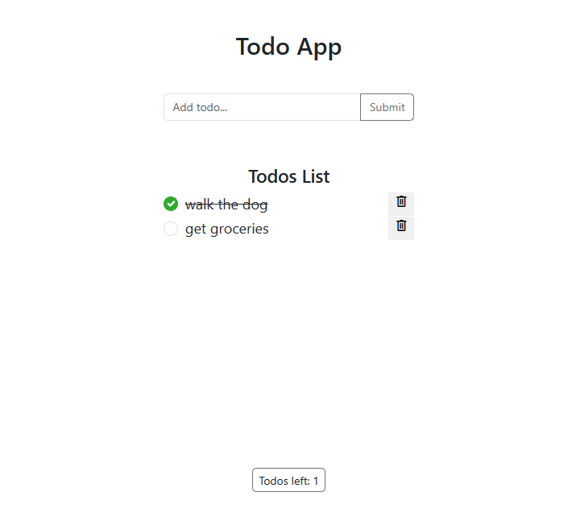

## Todo App using Express & MongoDB

## Description

My take on the app found in the course on Node.js and Express.js from [John Smilga](https://www.johnsmilga.com/) following the [freeCodeCamp course](https://www.youtube.com/watch?v=Oe421EPjeBE).

## Available Scripts

In the project directory, you can run:

### `npm start`

Runs the app in the development mode.\
Open [http://localhost:5000](http://localhost:5000) to view it in your browser.

The page will reload when you make changes.\
You may also see any lint errors in the console.

## Demo

#### Home Page

#### Error Page

